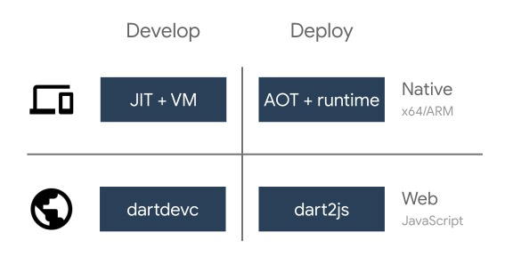

# Platform Dart

<figure><figcaption></figcaption></figure>

Teknologi _compiler_ yang fleksibel memungkinkan kode Dart dapat dijalankan dengan cara yang berbeda, tergantung target platform yang dituju.

* _**Dart Native**_ : Ditujukan untuk program yang menargetkan perangkat seluler, _desktop_, _server_, dan lainnya. Dart Native mencakup _**Dart VM**_ dengan kompilasi _**JIT**_ (_just-in-time_) dan kompiler _**AOT**_ (_ahead-of-time_) untuk menghasilkan kode mesin.
* _**Dart Web**_ : Ditujukan untuk program yang menargetkan web. Dart Web menyertakan kompiler _development_ (_**dartdevc**_) dan kompiler _production_ (_**dart2js**_).

#### Dart Native (VM JIT dan AOT)

_Dart Native_ memungkinkan kode Dart dijalankan dan dikompilasi dengan kode mesin ARM atau X64 native untuk aplikasi _mobile_, _desktop_, dan _server_.

Dart VM dilengkapi dengan _**just-in-time compiler (JIT)**_ yang mendukung interpretasi murni dan optimasi runtime. Lalu apa keuntungan dari menggunakan JIT? _Compiler_ bertugas untuk mengubah bahasa _high-level_ yang kita tulis menjadi bahasa _low-level_ yang dimengerti oleh mesin. _JIT compiler_ akan mengubah bahasa pemrograman yang kita tulis menjadi _intermediate language_ atau _bytecode_ seperti pada Java, selanjutnya instruksi ke mesin akan dilakukan hanya ketika dibutuhkan, sehingga disebut _just-in-time_. Metode ini akan membuat proses iterasi program menjadi lebih efisien.

Saat aplikasi siap digunakan untuk _production_, kita dapat memanfaatkan _**Dart AOT compiler**_. Apa ini? Apa bedanya dengan JIT? _AOT compilation_ akan mengubah bahasa _high-level_ atau _intermediate-level_ menjadi kode mesin pada mesin atau server sebelum aplikasi dijalankan. Kompilasi AOT akan menghasilkan _rendering_ aplikasi yang lebih cepat dan ukuran yang lebih kecil karena kode telah dikompilasi sebelum aplikasi dijalankan.

\

#### Dart Web (JavaScript)

_Dart Web_ memungkinkan kode Dart dijalankan pada platform web yang didukung oleh JavaScript. Dengan Dart Web, kode Dart akan dikompilasi ke kode JavaScript sehingga nantinya bisa berjalan di _browser_.

Dart Web menggunakan _**Dart dev compiler (dartdevc),**_ _compiler_ yang mengonversi kode Dart menjadi JavaScript.&#x20;

Untuk mengoptimalkan kode pada lingkungan _production_, terdapat _**dart2js compiler**_ yang dapat mengompilasi kode Dart dengan cepat dan ringkas. _Dart2js_ menggunakan teknik yang bisa mengeliminasi kode yang tidak perlu.
