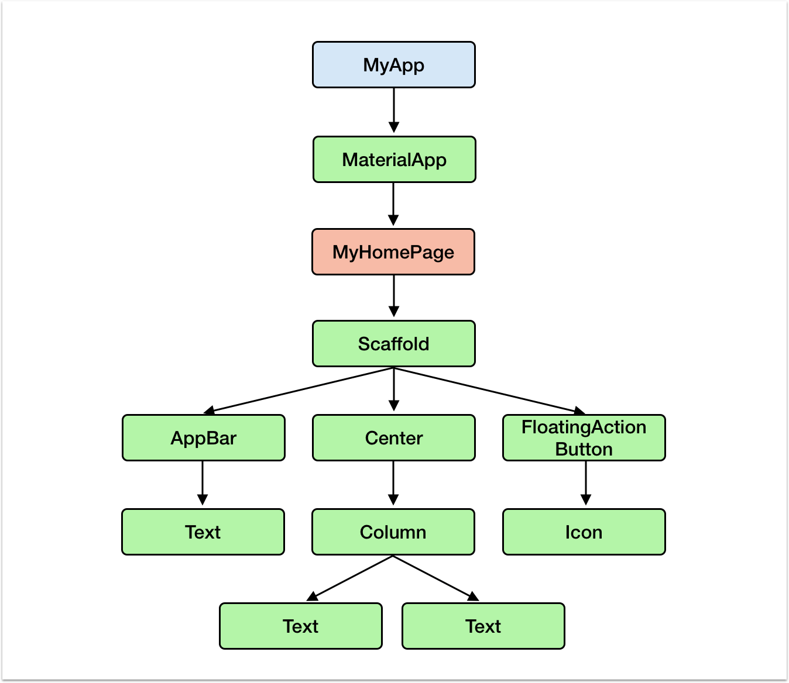
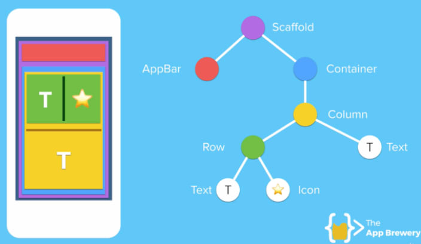

# Widget

Semua tampilan UI pada flutter menggunakan konsep widget yang dinamakan dengan widget tree. Widget itu seperti lego yang dapat kita susun bersama-sama untuk membuat sesuatu. Ingin membuat gambar? pakai image widget. Ingin membuat Text? Pakai text widget.

Beberapa Widget dasar antara lain

* Text Widget
* Button Widget
* Row Widget
* Column Widget
* Image Widget

Gambar diatas merupakan anatomi dari sebuah aplikasi flutter yang terdiri dari : \(lihat berdasarkan warna\)

* Scaffold
* AppBar
* Container
* Column
* Row 
* Text

Tidak perlu khawatir jika belum paham istilah-istilah diatas karena akan kita pelajari di modul berikutnya

_Referensi_





