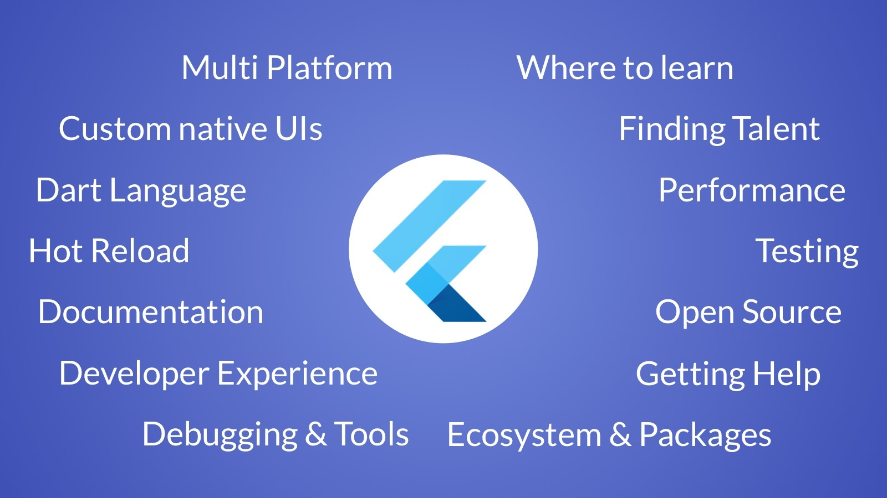

# Kenapa Flutter

Kenapa Menggunakan Flutter

* Hanya perlu menulis 1 codebase untuk semua platform
  * Android
  * iOS
  * Web
  * Desktop
* Support Native UI 
  * Menggunakan material design untuk Android
  * Cupertino Desing untuk iOS
  * dan semua bisa di custom
* Menggunakan Dart sebagai bahasa yang termasuk mudah dipelajari
* Tersedia banyak dokumentasi dan tutorial di website resminya

Basic yang harus dimiliki untuk belajar Flutter

* Variabel
* Asynchronous Code
* Function
* Classes

_Referensi_



